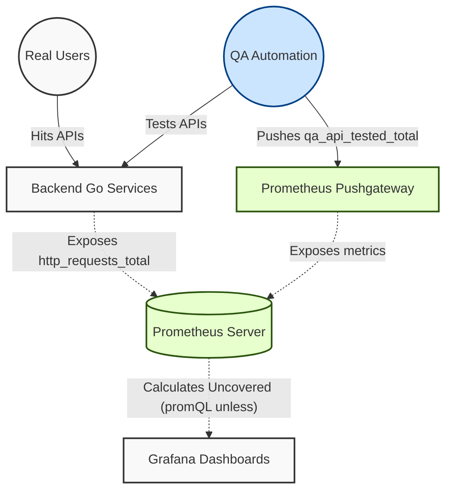

# Architecture Diagram

This diagram explains the flow of traffic versus the flow of metrics.

```mermaid
graph TD
    %% Entities
    Users((Real Users))
    QA((QA Automation))
    Backend[Backend Go Services]
    PushGW[Prometheus Pushgateway]
    Prom[(Prometheus Server)]
    Grafana[Grafana Dashboards]

    %% Traffic Flow
    Users -- Hits APIs --> Backend
    QA -- Tests APIs --> Backend

    %% Metrics Flow
    Backend -. Exposes http_requests_total .-> Prom
    QA -- Pushes qa_api_tested_total --> PushGW
    PushGW -. Exposes metrics .-> Prom

    %% Visualization
    Prom -. "Calculates Uncovered (promQL unless)" .-> Grafana

    classDef default fill:#f9f9f9,stroke:#333,stroke-width:2px;
    classDef qa fill:#cce5ff,stroke:#004085;
    classDef prom fill:#e6ffcc,stroke:#2b540f;
    class Users default;
    class QA qa;
    class Prom,PushGW prom;
```
