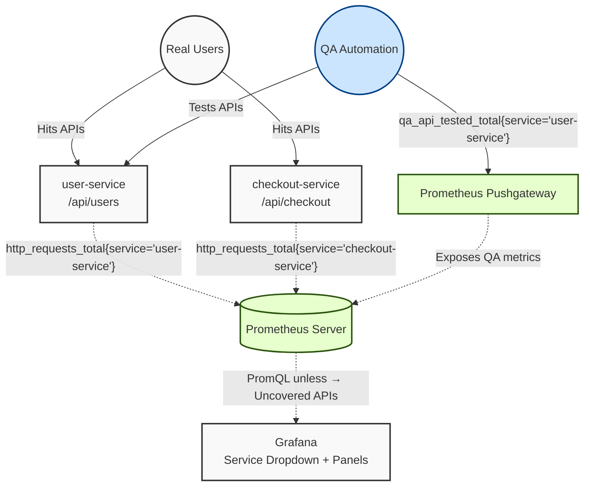

# Architecture Diagram

This diagram illustrates how traffic flows through the system and how Grafana computes per-service coverage.

```mermaid
graph TD
    %% Entities
    Users((Real Users))
    QA((QA Automation))
    US[user-service\n/api/users]
    CS[checkout-service\n/api/checkout]
    PushGW[Prometheus Pushgateway]
    Prom[(Prometheus Server)]
    Grafana[Grafana\nService Dropdown + Panels]

    %% Traffic Flow
    Users -- Hits APIs --> US
    Users -- Hits APIs --> CS
    QA -- Tests APIs --> US

    %% Metrics Flow
    US -. "http_requests_total{service='user-service'}" .-> Prom
    CS -. "http_requests_total{service='checkout-service'}" .-> Prom
    QA -- "qa_api_tested_total{service='user-service'}" --> PushGW
    PushGW -. Exposes QA metrics .-> Prom

    %% Visualization
    Prom -. "PromQL unless → Uncovered APIs" .-> Grafana

    classDef default fill:#f9f9f9,stroke:#333,stroke-width:2px;
    classDef qa fill:#cce5ff,stroke:#004085;
    classDef prom fill:#e6ffcc,stroke:#2b540f;
    class Users default;
    class QA qa;
    class Prom,PushGW prom;
```
