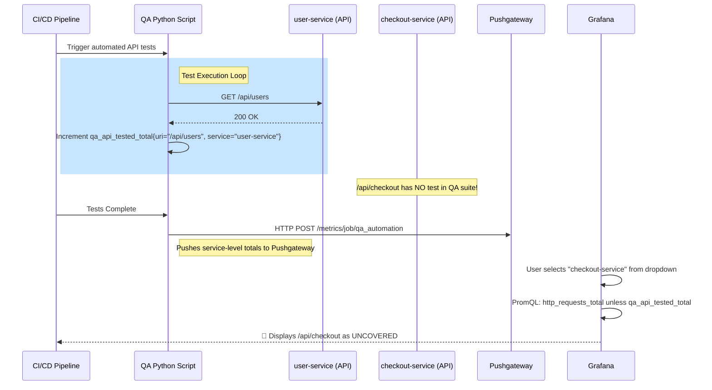

# Execution Sequence Diagram

This diagram shows the exact sequence of events during a multi-service test suite pipeline run.

```mermaid
sequenceDiagram
    participant Pipeline as CI/CD Pipeline
    participant QA as QA Python Script
    participant US as user-service (API)
    participant CS as checkout-service (API)
    participant PGW as Pushgateway
    participant Graf as Grafana

    Pipeline->>QA: Trigger automated API tests
    
    rect rgb(200, 229, 255)
    Note right of QA: Test Execution Loop
    QA->>US: GET /api/users
    US-->>QA: 200 OK
    QA->>QA: Increment qa_api_tested_total{uri="/api/users", service="user-service"}
    end
    
    Note over CS: /api/checkout has NO test in QA suite!

    Pipeline->>QA: Tests Complete
    QA->>PGW: HTTP POST /metrics/job/qa_automation
    Note right of QA: Pushes service-level totals to Pushgateway
    
    Graf->>Graf: User selects "checkout-service" from dropdown
    Graf->>Graf: PromQL: http_requests_total unless qa_api_tested_total
    Graf-->>Pipeline: 🚨 Displays /api/checkout as UNCOVERED
```
