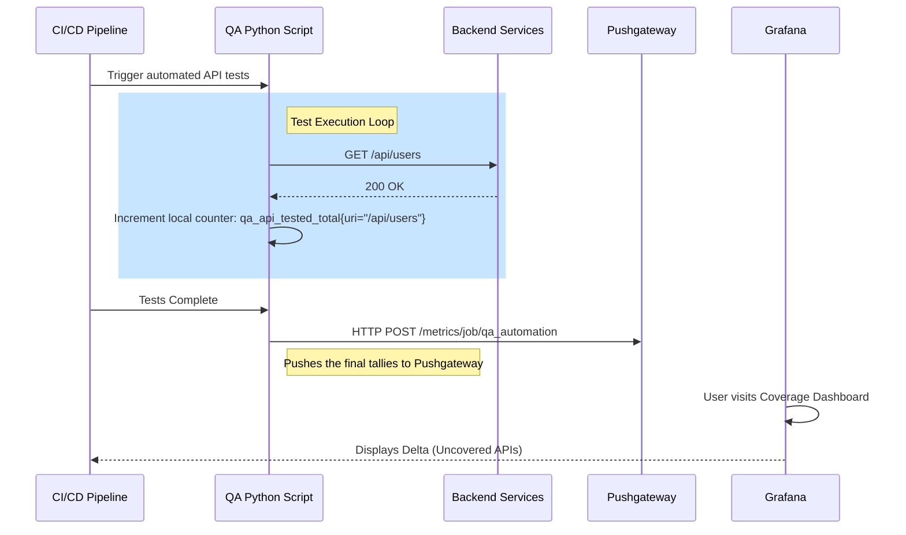

# Execution Sequence Diagram

This diagram shows the exact sequence of events during a test suite pipeline run.

```mermaid
sequenceDiagram
    participant Pipeline as CI/CD Pipeline
    participant QA as QA Python Script
    participant API as Backend Services
    participant PGW as Pushgateway
    participant Graf as Grafana

    Pipeline->>QA: Trigger automated API tests
    
    rect rgb(200, 229, 255)
    Note right of QA: Test Execution Loop
    QA->>API: GET /api/users
    API-->>QA: 200 OK
    QA->>QA: Increment local counter: qa_api_tested_total{uri="/api/users"}
    end
    
    Pipeline->>QA: Tests Complete
    QA->>PGW: HTTP POST /metrics/job/qa_automation
    Note right of QA: Pushes the final tallies to Pushgateway
    
    Graf->>Graf: User visits Coverage Dashboard
    Graf-->>Pipeline: Displays Delta (Uncovered APIs)
```
